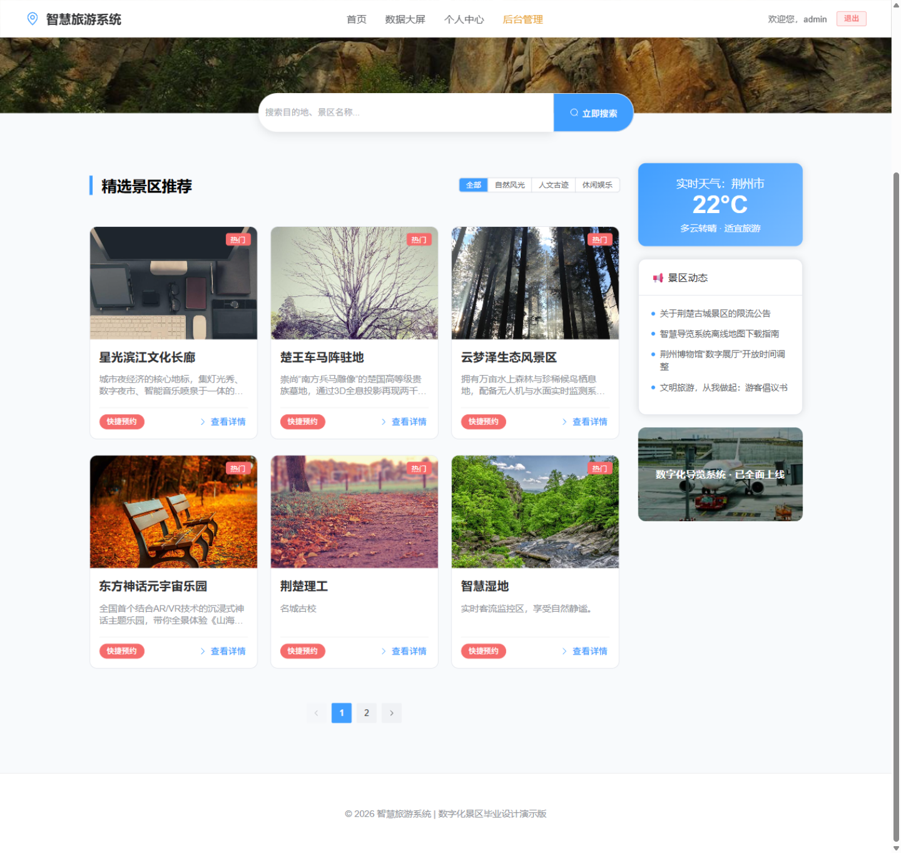
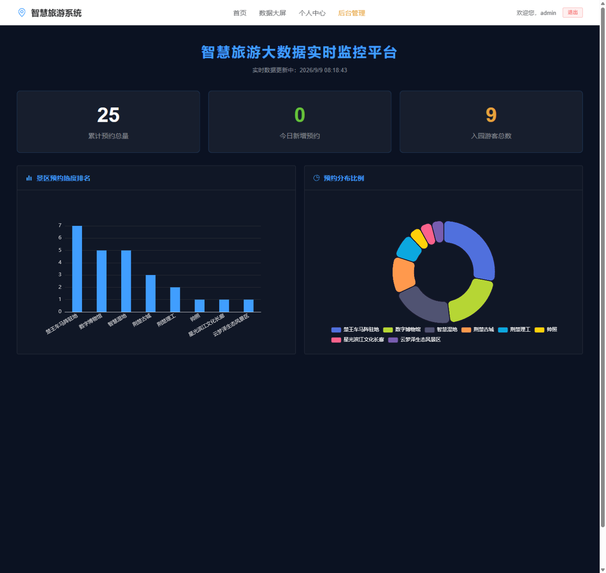
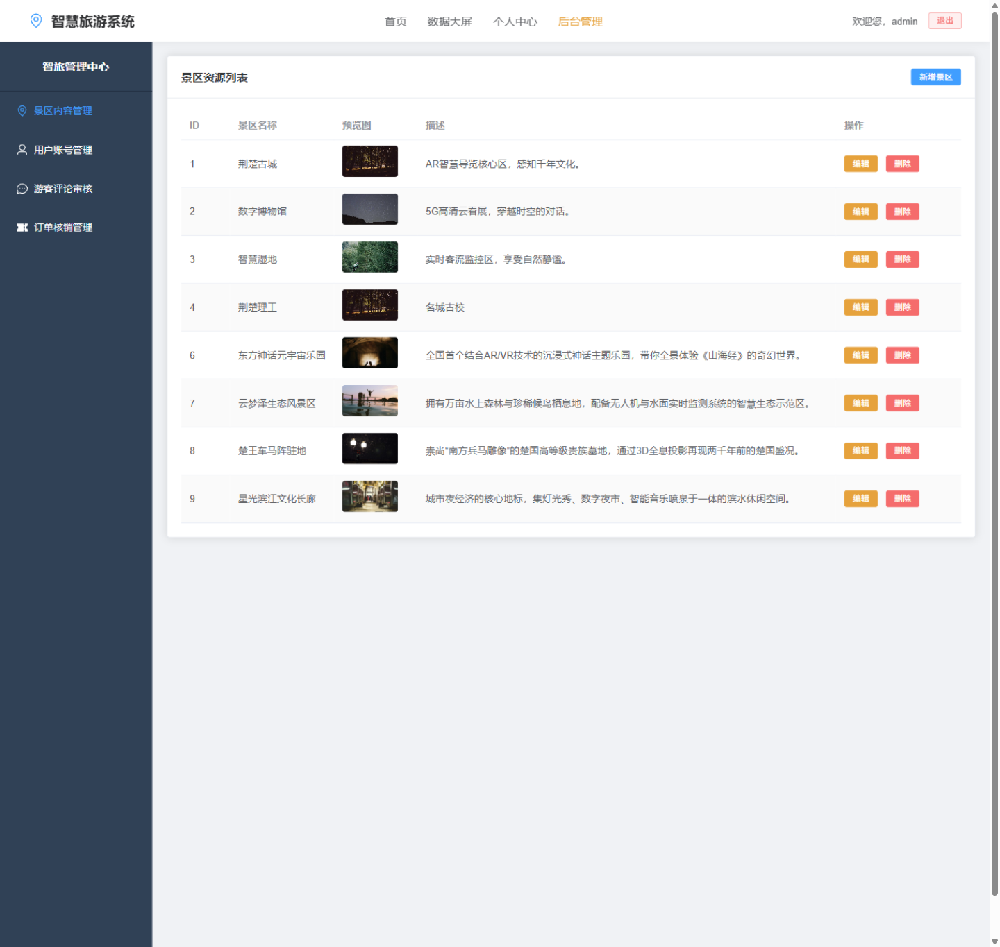

# 智旅出行 · 智慧旅游出行系统

[](https://spring.io/projects/spring-boot)
[](https://v3.vuejs.org/)
[](https://www.mysql.com/)
[](https://vitejs.dev/)

一个基于 **Spring Boot 3 + Vue 3** 前后端分离架构的智慧文旅平台。面向游客提供景点浏览、门票预订、订单管理与互动评价服务；面向运营方提供景点/用户后台管理与 ECharts 可视化数据大屏。项目按软件工程规范配有完整《需求规格说明书》（见 [需求文档.md](需求文档.md)）。

**在线演示（前端）**：<https://miracleboomq-netizen.github.io/travel/>（静态演示环境，接口数据需本地启动后端）

## 📸 系统截图

| 首页 · 景区推荐 | 景区详情 · GIS 攻略 |
| :---: | :---: |
|  |  |
| **数据大屏 · ECharts** | **后台管理 · 智旅管理中心** |
|  |  |

## ✨ 功能特性

### 游客端
- **景点探索**：景点列表检索、详情页展示（门票价格、图文介绍、评分）
- **门票预订**：选择景点下单，生成订单，个人中心统一管理
- **个人中心**：资料修改、头像上传、订单查询与取消
- **互动评价**：对已游览景点进行评分与点评

### 运营后台
- **景点管理**：景点信息的增删改查、图片上传
- **用户管理**：用户账号查询与管理
- **数据大屏**：基于 ECharts 的订单/客流可视化监控

### 规划中（详见需求文档）
- 百度地图 GIS 景点分布展示与多点路线规划
- O2O 二维码核销闭环（AES 加密凭证 + Redis 原子核销）
- RBAC 角色（游客 / 核销员 / 管理员）权限体系

## 🏗️ 项目结构

```text
travel
├── smart-travel/       # 后端服务（Spring Boot 3.2.5 + MyBatis-Plus + MySQL 8）
│   └── src/main/java/com/travel/smarttravel
│       ├── controller  # REST 接口：景点 / 订单 / 评价 / 用户 / 上传 / 后台管理
│       ├── entity      # 数据实体
│       ├── mapper      # MyBatis-Plus 数据访问层
│       ├── service     # 业务逻辑
│       └── config      # 全局配置（CORS、Web 等）
├── travel-web/         # 前端应用（Vue 3 + Vite + Element Plus）
│   └── src/views
│       ├── HomeView.vue       # 首页 / 景点探索
│       ├── SpotDetail.vue     # 景区详情
│       ├── LoginView.vue      # 登录 / 注册
│       ├── UserCenter.vue     # 个人中心
│       ├── AdminView.vue      # 管理后台
│       └── DashboardView.vue  # 数据监控大屏
├── studyit/            # Java 学习练习沙盒
├── untitled/           # 预留空项目
├── sql/                # 数据库初始化脚本（建库建表 + 景区/评价数据）
├── docs/screenshots/   # README 截图
└── 需求文档.md          # 软件需求规格说明书（SRS）
```

## 🛠️ 技术栈

| 层次 | 技术 | 说明 |
| :--- | :--- | :--- |
| 后端框架 | Spring Boot 3.2.5 | RESTful API 服务 |
| 持久层 | MyBatis-Plus 3.5.5 | ORM 与通用 CRUD |
| 数据库 | MySQL 8.0 | 业务数据存储（库名 `smart_travel`） |
| 前端框架 | Vue 3.5 + Vite 5 | Composition API + `<script setup>` |
| UI 组件库 | Element Plus 2.x | 桌面端组件 |
| 图表 | ECharts 6 | 数据大屏可视化 |
| 富文本 | wangEditor 5 | 图文内容编辑 |
| 二维码 | qrcode.vue 3 | 核销码渲染（规划中） |
| 网络请求 | Axios | HTTP 客户端 |
| 路由 | Vue Router 4 | SPA 路由管理 |

## 🚀 快速开始

### 环境要求

- JDK 17+
- Node.js 18+
- MySQL 8.0

### 1. 初始化数据库

执行仓库自带的初始化脚本（自动建库建表，并导入景区与评价数据）：

```bash
mysql -uroot -p < sql/smart_travel.sql
```

### 2. 启动后端

```bash
cd smart-travel
# 按需修改 src/main/resources/application.properties 中的数据库账号密码
./mvnw spring-boot:run
```

后端默认运行在 <http://localhost:8080>。

### 3. 启动前端

```bash
cd travel-web
npm install
npm run dev
```

访问终端输出的本地地址即可打开系统。演示账号：`admin / 123456`（管理员），`muyu / 123456`（游客）。

> **接口地址说明**：前端统一从环境变量 `VITE_API_BASE_URL` 读取后端地址（见 `travel-web/src/api/index.js`）。
> 本地开发默认指向 `http://localhost:8080`，且 Vite 开发服务器已配置 `/api`、`/uploads` 代理，接口与图片请求均转发到后端；
> 静态部署时在 `.env.production` 中调整该变量即可，无需改动业务代码。

## 📖 文档

- [需求文档.md](需求文档.md) —— 完整的需求规格说明书：项目背景、系统架构、角色用例、功能需求、数据库 E-R 设计与非功能性需求

## 🤝 参与贡献

1. Fork 本仓库
2. 新建 `feat_xxx` 分支
3. 提交代码
4. 新建 Pull Request

---

© 2026 [miracleboomq-netizen](https://github.com/miracleboomq-netizen)
